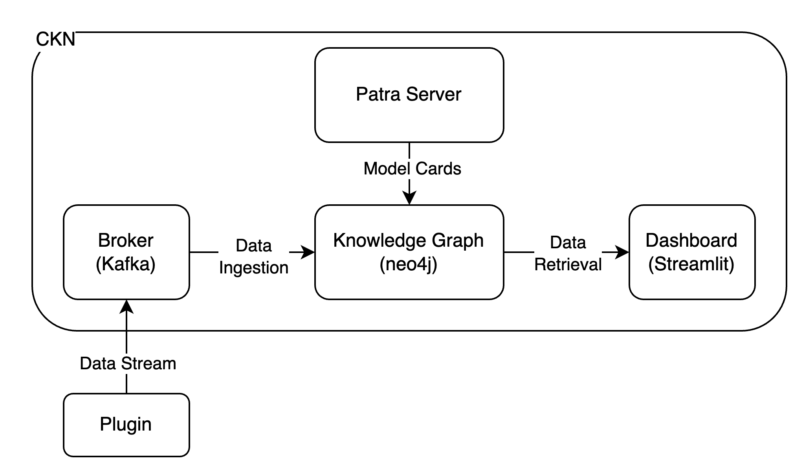

# Cyberinfrastructure Knowledge Network (CKN)

CKN connects the Edge to the cloud with specialized components for data ingestion, processing, and visualization. 



## Components

- **Broker**: Configures Kafka broker, topics, and connectors for streaming data.
- **Knowledge Graph**: Manages Neo4j database infrastructure and connections.
- **Stream Processors**: Integrates with CKN to enhance data processing workflows. More details can be found in the [CKN Stream Processors repository](https://github.com/Data-to-Insight-Center/ckn-stream-processors).
- **Dashboard**: Provides a Streamlit dashboard for visualizing data from the knowledge graph and a chatbot powered by a large language model.

## Plugins

- **Oracle CKN Daemon**: Reads, processes, and sends camera trap events from Oracle Daemon and Power Measuring plugin.

## Getting Started

### Prerequisites

- Ensure docker and docker-compose is installed and running on your machine.

### Quickstart
We use Docker Compose to create an environment with Confluent Platform components and Neo4j running inside Docker.

- **Clone the repository and run:**
   ```bash
   make up
   ```
   When the process completes you can check if all the modules up and running with:
   ```bash
    docker compose ps
    ```

<br>

- **To produce [an example event](plugins/example/event.json), run:**
   ```bash
   docker compose -f plugins/example/docker-compose.yml up -d --build
   ```
  View the streamed data on the [dashboard](http://localhost:8502/Camera_Traps) or check the [local neo4j instance](http://localhost:7474/browser/) with username `neo4j` and password `PWD_HERE`.

<br>

- **To shut down and remove all containers, run:**
    ```bash
    make down
   docker compose -f plugins/example/docker-compose.yml down
    ```